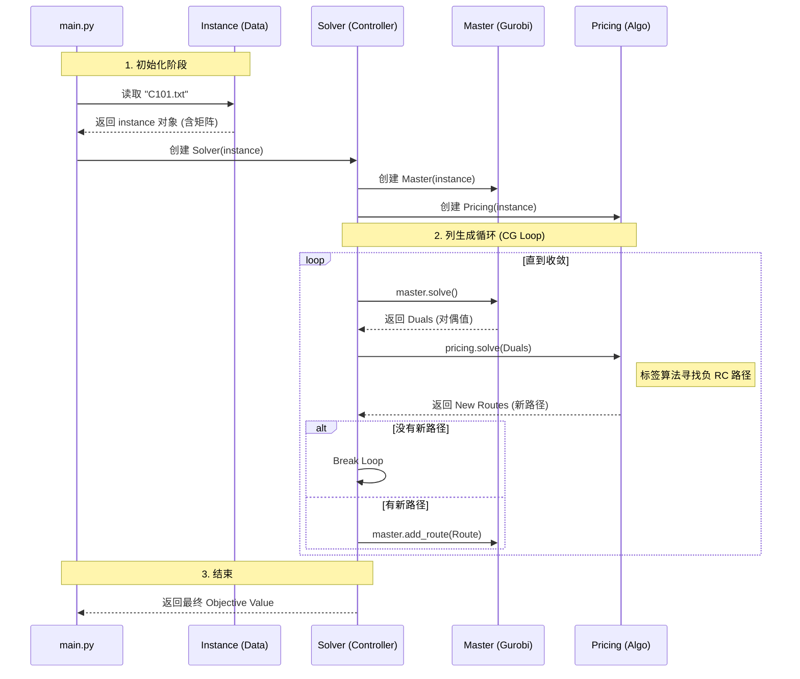

这份文档是你的项目的**架构蓝图**。

当你以后需要修改代码，或者要把项目介绍给别人时，这份文档就是你的导航图。它清晰地解释了**“每一块积木是干什么的”**以及**“积木之间怎么连接”**。

---

# VRPTW 列生成求解器架构文档

**版本**：1.0
**架构模式**：模块化设计 (Modular Design) / 面向对象 (OOP)
**核心算法**：列生成 (Column Generation)
**依赖库**：`gurobipy`, `numpy` (可选), `dataclasses`

---

## 1. 项目目录概览

```text
my_vrp_solve/
│
├── data/                  # [数据层] 存放原始输入文件
│   └── C101.txt           # Solomon 标准测试集
│
├── src/                   # [核心代码层]
│   ├── __init__.py        # 标识 src 为 Python 包
│   ├── models.py          # [原子] 定义基础数据结构 (Data Class)
│   ├── instance.py        # [仓库] 负责读取数据、存储全局只读状态
│   ├── pricing.py         # [工兵] 定价子问题求解器 (Label Algorithm)
│   ├── master.py          # [大脑] 主问题模型维护 (Gurobi Wrapper)
│   └── solver.py          # [指挥] 核心循环控制器
│
└── main.py                # [入口] 程序启动脚本

```

---

## 2. 模块详细职责与依赖关系

### 2.1. 基础层 (The Foundation)

#### `src/models.py`

* **角色**：**模具 / 字典定义**
* **职责**：
* 定义数据的“形状”。
* 包含 `Customer` 类（定义一个客户有哪些属性：ID, 坐标, 需求, 时间窗）。


* **联系**：
* **被谁依赖**：几乎所有文件 (`instance`, `pricing`)。
* **依赖谁**：无（最底层，纯净）。


#### `src/instance.py`

* **角色**：**档案室 / 数据库**
* **职责**：
* **ETL**：读取 `.txt` 文件，解析文本，实例化 `Customer` 对象。
* **计算**：计算全局距离矩阵 `dist_matrix`。
* **只读**：作为“上帝对象”，向其他模块提供数据查询服务。


* **联系**：
* **被谁依赖**：`pricing.py`, `master.py`, `solver.py`。它们初始化时都需要传入 `instance`。
* **依赖谁**：`models.py`。


### 2.2. 算法层 (The Engine)

#### `src/pricing.py`

* **角色**：**探路者 / 研发部**
* **职责**：
* 解决 ESPPRC 子问题。
* 维护 `Label` 类和扩展逻辑 (`_extend`)。
* 执行支配规则剪枝 (`_is_dominated`)。
* **输入**：主问题给的“对偶值 (Duals)”。
* **输出**：一条或多条“Reduced Cost < 0”的路径 (`Route`)。


* **联系**：
* **依赖谁**：`instance.py` (查距离和时间窗)。
* **被谁调用**：`solver.py`。


#### `src/master.py`

* **角色**：**决策者 / 财务部**
* **职责**：
* 封装 Gurobi 模型。
* 初始化覆盖约束。
* 提供 `solve()` 接口：求解 LP，返回对偶值。
* 提供 `add_route()` 接口：将 `pricing` 找到的路径转化为 Gurobi 的列 (Column) 加入模型。


* **联系**：
* **依赖谁**：`instance.py` (查距离算成本), `gurobipy`。
* **被谁调用**：`solver.py`。


### 2.3. 控制层 (The Controller)

#### `src/solver.py`

* **角色**：**项目经理 / 调度员**
* **职责**：
* 持有 `MasterProblem` 和 `PricingSolver` 的实例。
* 运行 `while True` 循环。
* 负责数据搬运：把 Master 的 Duals 传给 Pricing，把 Pricing 的 Routes 传给 Master。
* 判断收敛条件（当 Pricing 找不到新路径时停止）。


* **联系**：
* **依赖谁**：`instance`, `master`, `pricing`。


#### `main.py`

* **角色**：**启动按钮**
* **职责**：
* 配置参数（文件路径、测试规模）。
* 组装对象：`main` -> 创建 `instance` -> 塞给 `solver` -> `run()`。
* 统计运行时间。


---

## 3. 动态运行流程图 (Runtime Flow)

为了让你看清代码是怎么“跑”起来的，以下是数据流动的全过程：



---

## 4. 为什么这样设计？(架构师视角的 Q&A)

### Q1: 为什么要有个 `instance.py`？

* **解耦**：如果以后你要改读文件的逻辑（比如从 Excel 读），你只需要改 `instance.py` 一个文件。`master.py` 和 `pricing.py` 根本不需要知道数据是从哪来的，它们只管用。

### Q2: 为什么 `master.py` 不直接调用 `pricing.py`？

* **控制反转**：总经理（Master）和工兵（Pricing）平级，不应该互相依赖。
* 通过 `solver.py` 作为中间人协调，以后如果你想把 `pricing.py` 换成一个“启发式算法”或者“并行计算”，只需要改 `solver.py` 的调度逻辑，不需要改动 `master.py` 的代码。

### Q3: 修改代码指南

* **如果要加车辆容量限制？** -> 修改 `pricing.py` 的 `_extend` 函数（逻辑） + `models.py`（如果需要新字段）。
* **如果要换求解器（不用 Gurobi）？** -> 重写 `master.py`，保持接口不变。
* **如果要加分支定界？** -> 在 `src/` 下新建 `branching.py`，并在 `solver.py` 里调用它。

这份文档不仅解释了**现在**的代码，也为你**未来**的扩展指明了方向。保存好它！